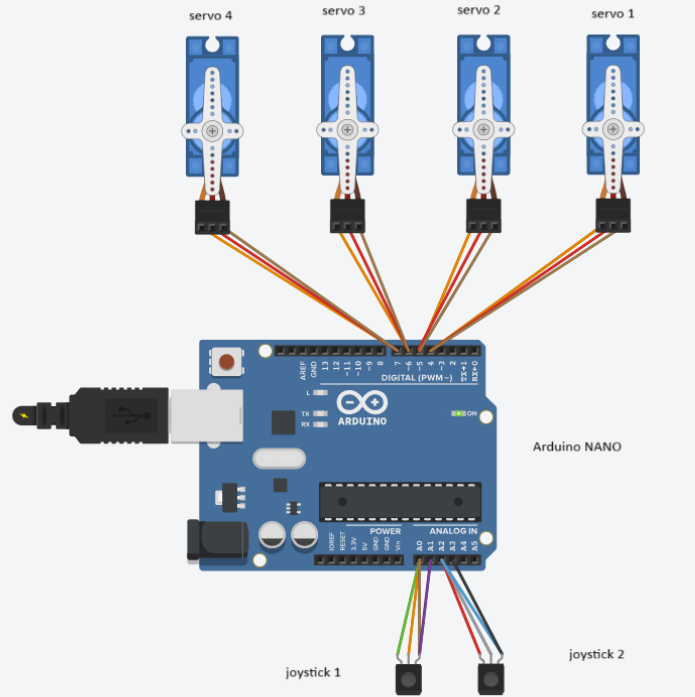

# Robotic Arm/Claw Machine
Replace this text with a brief description (2-3 sentences) of your project. This description should draw the reader in and make them interested in what you've built. You can include what the biggest challenges, takeaways, and triumphs from completing the project were. As you complete your portfolio, remember your audience is less familiar than you are with all that your project entails!

You should comment out all portions of your portfolio that you have not completed yet, as well as any instructions:
```HTML 
<!--- This is an HTML comment in Markdown -->
<!--- Anything between these symbols will not render on the published site -->
```

| **Engineer** | **School** | **Area of Interest** | **Grade** |
|:--:|:--:|:--:|:--:|
| Coby L | Sage Creek | Engineering Design | Rising Junior

**Replace the BlueStamp logo below with an image of yourself and your completed project. Follow the guide [here](https://tomcam.github.io/least-github-pages/adding-images-github-pages-site.html) if you need help.**


  
# Final Milestone

**Don't forget to replace the text below with the embedding for your milestone video. Go to Youtube, click Share -> Embed, and copy and paste the code to replace what's below.**

<iframe width="560" height="315" src="https://www.youtube.com/embed/F7M7imOVGug" title="YouTube video player" frameborder="0" allow="accelerometer; autoplay; clipboard-write; encrypted-media; gyroscope; picture-in-picture; web-share" allowfullscreen></iframe>

For your final milestone, explain the outcome of your project. Key details to include are:
- Since the previous milestone, I constructed an enclosure for my robotic arm to act as a claw machine. It is made using mainly cardboard and hot glue. There is an area filled with candy for the arm to grab and a drop off area with two outcomes, win or lose.
- Challenges I came across during my time at BlueStamp Engineering was the introduction of C++ in the base project. I overcame the coding challenges by understanding the new language through many hours of testing and researching, improving with each error. I also deepened my understanding of coding as well as the basic circuitry behind many machines including the servos, wiring, pins, etc. 
- Broader topics I learned through BlueStamp include perseverence and adaptability, which are important when struggling because they allow you to push through and make changes based on problems in your current situation. I faced this when my arm did not work as intended. At first I thought it was a mechanical error, so I tried creating my own claw, but after many tries, I noticed that each claw, no matter the design, had a common error, not being able to stay closed while moving in other motions whether it was U/D or L/R. Using this knowledge, I found that it was not a coding error, but a coding limitation. When there is an object between the claws, it confuses the servo because the angle value is more closed than the actual claw, due to object obstruction. This caused the claw to open and close randomly. I tried many things like ensuring only one motion could move at a time, slowing the motion speed, and more. A solution I found was to adjust the library, rather than my actual code. I limited the close value to a certain amount the prevent confusion and just like that, the claw was able to grab the prize candy.
- I also improved my documentation skills, which can also apply to life later on. We had to report weekly updates through github, which helped me write and record, while increasing my experience using Github. Documentation is useful because it forces you to track your progress, which I found very helpful during BlueStamp because it improved my pacing, allowing me to stay on track. I even finished my project and the modification a few days early, allowing me to spend time on the rest of the documentation required. 


# Second Milestone


[](https://www.youtube.com/watch?v=Sq0_jAAt7Ok)


- For milestone 2, I completed my code for the robotic arm and it now functions as it should, rotating at the base, moving up and down at the joints, and opening and closing at the claw.
- Something surprising about the project so far was the code. It was a lot shorter than I expected, but it was still very complex to me toward the start. As each day went on, I started understanding each line of code more and more with help from the internet, reference codes, and my instructor, Josh.
- A challenge I encountered was the smoothness of the UP/DOWN motion. We determined it was a hardware error, but I improved the smoothness as much as I could be adjusting some values in the code like the delay and angles.
- For my final milestone, I will have my modification complete as well as the documentation. I will also have to prepare for demo night and have this portfolio fully completed.

# First Milestone


[](https://www.youtube.com/watch?v=QUYMb4puTQo)


- Key components of my robot include the servos, joysticks, and shield/nano. The servo allows motion at each joint, the joysticks send signals to control the servos, and the shield pairs the Arduino code from my PC to the robot.
- For my first milestone, I completed the construction aspect of the robot, as well as the testing of the servos, joysticks, and shield/nano.
- A challenge I faced was that the designated shield was not compatible with the servos because it was too weak. I had to improvise and use an alternative shield, which could not attach to the robot as shown in the instructions. I altered the original build to successfully incorporate the new shield, allowing the servos to function.
- For milestone 2, I plan on having a working, running code that will allow me to control my robot using the joysticks.

# Schematics 


# Code

```c++
#include "CokoinoArm.h"

CokoinoArm arm;
int xL, yL, xR, yR;

void turnUD() {
  if (abs(xL - 512) > 20) {
    if (xL < 128) {arm.up(5); return;}
    if (xL > 896) {arm.down(5); return;}
    if (xL >= 128 && xL < 256) {arm.up(15); return;)
    if (xL > 768 && xL <= 896) {arm.down(15); return;}
  }
}

void turnLR() {
  if (abs(yL - 512) > 20) {
    if (yL < 128) {arm.right(5); return;}
    if (yL > 896) {arm.left(5); return;}
    if (yL >= 128 && yL < 256) {arm.right(15); return;}
    if (yL > 768 && yL <- 896) {arm.left(15); return;}
  }
}

void turnCO() {
  if (abs(xR - 512) > 20) {
    if (xR < 128) {arm.close(0); return;}
    if (xR > 896) {arm.open(0); return;}
    if (xR >= 128 && xR < 256) {arm.close(10); return;}
    if (xR > 768 && xR <= 896) {arm.open(10); return;}
  }
}

void setup() {
  arm.ServoAttach(4, 5, 6, 7);
  arm.JoyStickAttach(A0, A1, A2, A3);
}

void loop() {
  xL = arm.JoystickL.read_x();
  yL = arm.JoystickL.read_y();
  xR = arm.JoystickR.read_x();
  yR = arm.JoystickL.read_y();

  turnUD():
  turnLR();
  turnCO();
}
```

# Bill of Materials
Here's where you'll list the parts in your project. To add more rows, just copy and paste the example rows below.
Don't forget to place the link of where to buy each component inside the quotation marks in the corresponding row after href =. Follow the guide [here]([url](https://www.markdownguide.org/extended-syntax/)) to learn how to customize this to your project needs. 

| **Part** | **Note** | **Price** | **Link** |
|:--:|:--:|:--:|:--:|
| Item Name | What the item is used for | $Price | <a href="https://www.amazon.com/Arduino-A000066-ARDUINO-UNO-R3/dp/B008GRTSV6/"> Link </a> |
| Item Name | What the item is used for | $Price | <a href="https://www.amazon.com/Arduino-A000066-ARDUINO-UNO-R3/dp/B008GRTSV6/"> Link </a> |
| Item Name | What the item is used for | $Price | <a href="https://www.amazon.com/Arduino-A000066-ARDUINO-UNO-R3/dp/B008GRTSV6/"> Link </a> |

# Other Resources/Examples
One of the best parts about Github is that you can view how other people set up their own work. Here are some past BSE portfolios that are awesome examples. You can view how they set up their portfolio, and you can view their index.md files to understand how they implemented different portfolio components.
- [Example 1](https://trashytuber.github.io/YimingJiaBlueStamp/)
- [Example 2](https://sviatil0.github.io/Sviatoslav_BSE/)
- [Example 3](https://arneshkumar.github.io/arneshbluestamp/)

To watch the BSE tutorial on how to create a portfolio, click here.
